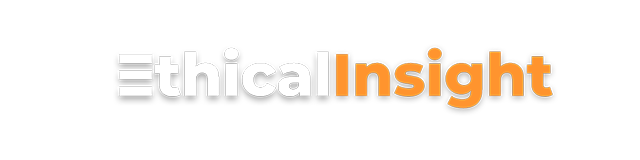
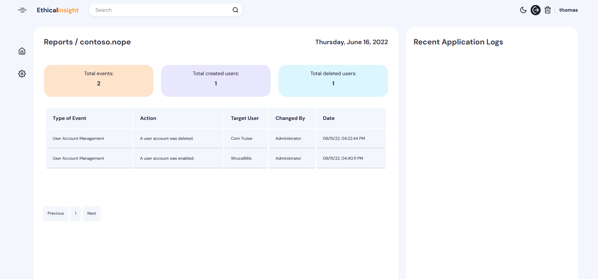
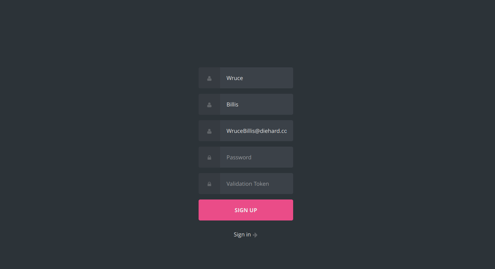
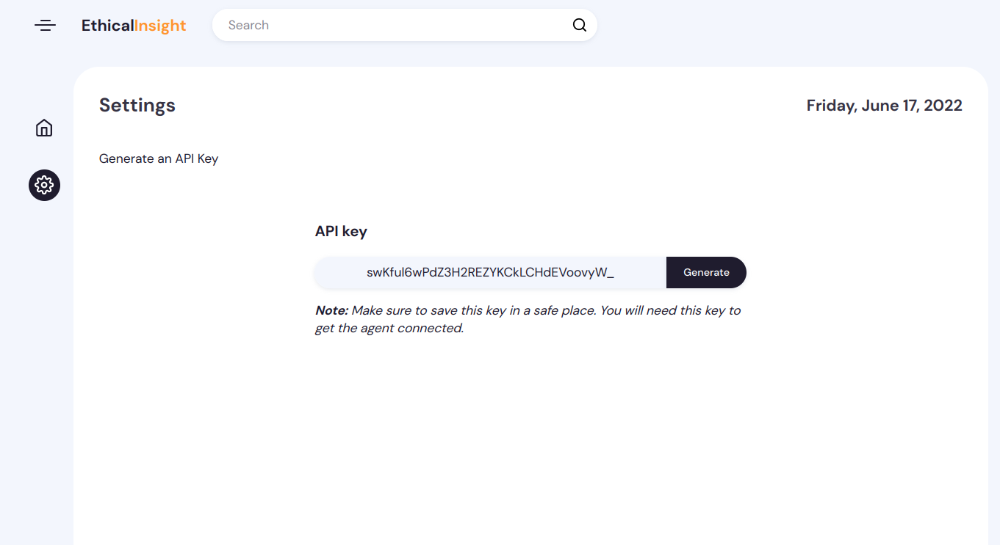
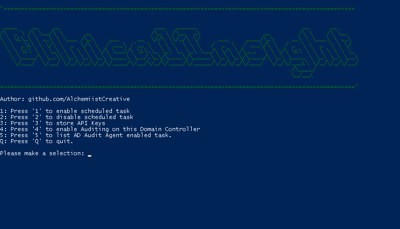

<div id="top"></div>

[![Contributors][contributors-shield]][contributors-url]
[![Forks][forks-shield]][forks-url]
[![Stargazers][stars-shield]][stars-url]
[![Issues][issues-shield]][issues-url]
[![MIT License][license-shield]][license-url]
[![LinkedIn][linkedin-shield]][linkedin-url]


<!-- PROJECT LOGO -->
<br />
<div align="center">
    <a href="https://github.com/AlchemiistCreative/EthicalInsight">
        
    </a>
    
---
  
 <h3 align="center">Centralized Active Directory Auditing Tool</h3>
  <p align="center">
    <br />
    <a href="https://github.com/AlchemiistCreative/EthicalInsight"><strong>Explore the docs »</strong></a>
    <br />
    <br />
    <a href="https://github.com/AlchemiistCreative/EthicalInsight/issues">Report Bug</a>
    ·
    <a href="https://github.com/AlchemiistCreative/EthicalInsight/issues">Request Feature</a>
  </p>
</div>


<!-- TABLE OF CONTENTS -->
<details>
  <summary>Table of Contents</summary>
  <ol>
    <li>
      <a href="#about-the-project">About The Project</a>
      <ul>
        <li><a href="#built-with">Built With</a></li>
      </ul>
    </li>
    <li>
      <a href="#getting-started">Getting Started</a>
      <ul>
        <li><a href="#prerequisites">Prerequisites</a></li>
        <li><a href="#installation">Installation</a></li>
      </ul>
    </li>
    <li><a href="#usage">Usage</a></li>
    <li><a href="#contributing">Contributing</a></li>
    <li><a href="#license">License</a></li>
    <li><a href="#contact">Contact</a></li>

  </ol>
</details>


<!-- ABOUT THE PROJECT -->
## About The Project
<div align="center">

</div>
<br />

I started this project to complete some needs that I met and to be able to adapt them as I want.
You are free to <a href="#contributing">contribute</a> to this project and bring some new features.

The project consists in centralizing the audit of one or several AD domain controllers. 
It's working with a powershell script as agent on the DC, pushing several data to MongoDB through a REST API. 

<p align="right">(<a href="#top">back to top</a>)</p>


### Built With


* [Node.js](https://nextjs.org/)
* [Express.js](https://expressjs.com/)
* [MongooseJS](https://mongoosejs.com/)
* [DataTables](https://datatables.net/)

<p align="right">(<a href="#top">back to top</a>)</p>


<!-- GETTING STARTED -->
## Getting Started


### Prerequisites

For the client parts:

You will need to setup the powershell script on your Domain Controller(s).
You can find them on this repository: [github.com/AlchemiistCreative/EthicalInsight-Agent](https://github.com/AlchemiistCreative/EthicalInsight-Agent)

For the server parts:

You will need a MongoDB instance.

### Installation


1. Clone the repo
   ```sh
   git clone https://github.com/AlchemiistCreative/EthicalInsight.git
   ```
2. Install NPM packages
   ```sh
   npm install
   ```
3. Enter your config in `.env`
   ```js
   PORT=8080
   VALIDATION_TOKEN=0000
   MONGODB_URL="mongodb://example:27017/example-db"
   TOKEN_KEY="random_string"
   ```

<p align="right">(<a href="#top">back to top</a>)</p>


## Usage

### 1. Register

Create an Account with the validation token you have set up in the .env file.




### 2. Generate an API key

Generate an API key in settings (make sure to save this key in a safe place, you will need this key to get the agent connected).



### 3. Run scripts on Domain Controller(s)

Run ethicalinsight-agent.ps1 on your Domain Controller(s).



3.1 Clone this repo
```powershell
git clone https://github.com/AlchemiistCreative/EthicalInsight-Agent.git
```
3.2 Check the execution policy to be sure that you are able to run scripts.
```powershell
 Get-ExecutionPolicy
```
To run the scripts, the execution policy must be Unrestricted/Bypass but if you are in RemoteSigned, you still can copy the contents of the scripts and create new ones. (Be careful about the file names, must be exactly the same to works).

3.3 Run ethicalinsight-agent.ps1
```powershell
.\ethicalinsight-agent.ps1 #From the correct directory location.
```

From this menu you have to store your API key, activate the audit and also enable the scheduled task.


_For more examples, please refer to the [Documentation](https://example.com)_

<p align="right">(<a href="#top">back to top</a>)</p>

<!-- CONTRIBUTING -->
## Contributing

Contributions are what make the open source community such an amazing place to learn, inspire, and create. Any contributions you make are **greatly appreciated**.

If you have a suggestion that would make this better, please fork the repo and create a pull request. You can also simply open an issue with the tag "enhancement".
Don't forget to give the project a star! Thanks again!

1. Fork the Project
2. Create your Feature Branch (`git checkout -b feature/AmazingFeature`)
3. Commit your Changes (`git commit -m 'Add some AmazingFeature'`)
4. Push to the Branch (`git push origin feature/AmazingFeature`)
5. Open a Pull Request

<p align="right">(<a href="#top">back to top</a>)</p>


<!-- LICENSE -->
## License

Distributed under the GNUv3. See `LICENSE` for more information.

<p align="right">(<a href="#top">back to top</a>)</p>


<!-- CONTACT -->
## Contact

Your Name - [@alchmst_](https://twitter.com/alchmst_) - contact@thomasfrancois.net

Project Link: [https://github.com/AlchemiistCreative/EthicalInsight](https://github.com/AlchemiistCreative/EthicalInsight)

<p align="right">(<a href="#top">back to top</a>)</p>


<!-- MARKDOWN LINKS & IMAGES -->

[contributors-shield]: https://img.shields.io/github/contributors/AlchemiistCreative/EthicalInsight.svg?style=for-the-badge
[contributors-url]: https://github.com/AlchemiistCreative/EthicalInsight/graphs/contributors
[forks-shield]: https://img.shields.io/github/forks/AlchemiistCreative/EthicalInsight.svg?style=for-the-badge
[forks-url]: https://github.com/AlchemiistCreative/EthicalInsight/network/members
[stars-shield]: https://img.shields.io/github/stars/AlchemiistCreative/EthicalInsight.svg?style=for-the-badge
[stars-url]: https://github.com/AlchemiistCreative/EthicalInsight/stargazers
[issues-shield]: https://img.shields.io/github/issues/AlchemiistCreative/EthicalInsight.svg?style=for-the-badge
[issues-url]: https://github.com/AlchemiistCreative/EthicalInsight/issues
[license-shield]: https://img.shields.io/github/issues/AlchemiistCreative/EthicalInsight.svg?style=for-the-badge
[license-url]: https://raw.githubusercontent.com/AlchemiistCreative/EthicalInsight/main/LICENSE
[linkedin-shield]: https://img.shields.io/badge/-LinkedIn-black.svg?style=for-the-badge&logo=linkedin&colorB=555
[linkedin-url]: https://www.linkedin.com/in/thomasfrancois-cv/
[product-screenshot]: images/screenshot.png
